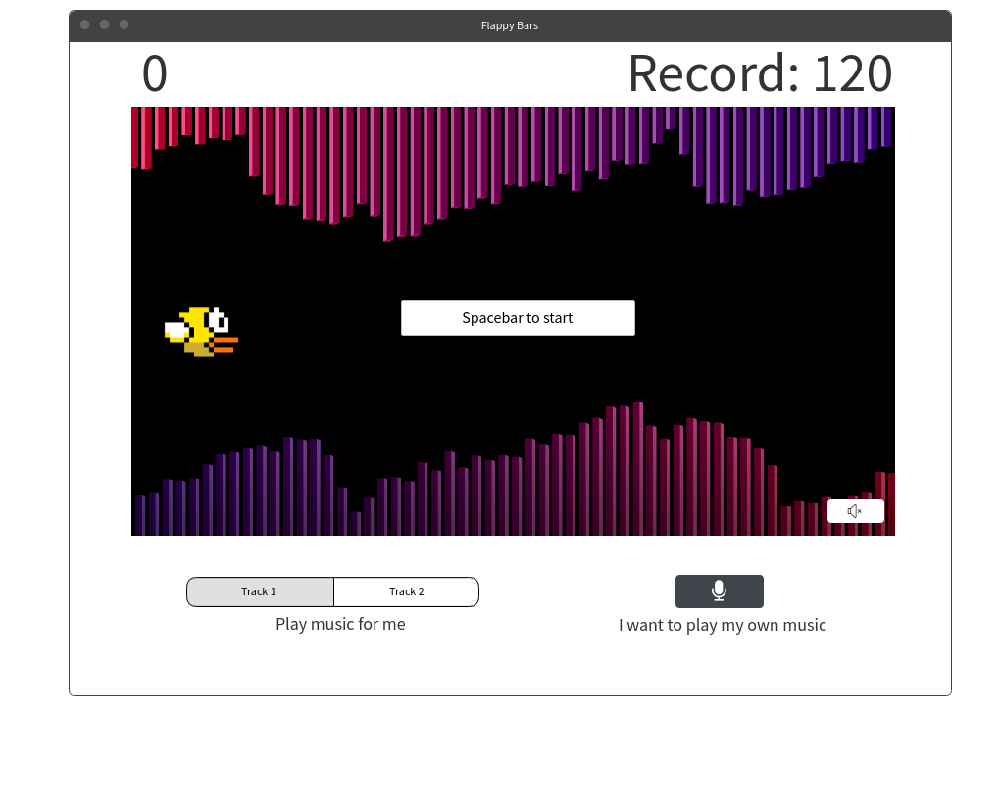

## Flappy Bars

### Background and Overview

Flappy Bars combines the challenge of Flappy Birds with a music experience. Users will be able to navigate their character through an ever changing path of musical bars.

I've been intrigued by music visualizers ever since the days of Winamp (anyone else out there?) but it's fun to do be able to interact with it at the same time.

The musical bars will be above and below the character and will (likely) be mirrored vertically and horizontally to create more variety in gameplay. Possibly adding multiple heights for the bars to increase or decrease the difficulty of an already difficult game.

### Functionality & MVP  

In Flappy Bars, players will be able to:

- [ ] Control the height of their character incrementally based on the number of time they press the spacebar
- [ ] Hear sounds on collisions
- [ ] Choose to play their own music and have the visualization react to it
- [ ] Start, restart, and reset the game
- [ ] Choose preloaded songs that the visualization will react to

### Wireframes

This app will consist of a single screen, containing both the current score, and the player's all-time highest score.

Controls will initially be displayed on screen: "Spacebar to start" and then hidden. Reshown on game over. There is also a toggle for volume on the corner of the canvas.

Below the canvas, players can choose from preloaded music that the visualizer will respond to, or they can click on the microphone button to play their own audio.

### Architecture and Technologies

This project will be implemented with the following technologies:

- Vanilla JavaScript for overall structure and game logic,
- `HTML5 Canvas` for DOM manipulation and rendering,
- `Web Audio API` for sound input from users,
- Webpack to bundle and serve up the various scripts.

In addition to the webpack entry file, there will be four scripts involved in this project:

`game.js`: this script will handle the overall game logic

`visualizer.js`: this script will handle the creation of the visuals based on the audio input

`audio.js`: this script will handle retrieving either user audio or feeding in seeded audio to the visualizer

`flappy.js`: this script will handle the appearance and behavior of the player-controlled character.  

### Implementation Timeline

**Over the weekend**:

- [ ] Take the WebAudioAPI tutorial
- [ ] Be able to load static assets and play them back

**Day 1**: Configure the project

- [ ] Not sure of the details here, maybe webpack.config, entry file things?
- [ ] Create the beginnings of the script files above?

**Day 1**: Learn and implement the `Web Audio` API.

- [ ] Be able to tie audio assets to canvas visualization
- [ ] Play, stop and restart audio
- [ ] Import user audio

**Day 3**: Create the visualizations

- [ ] Learn canvas
- [ ] Map them to the audio input received above
- [ ] Style it professionally

**Day 4**: Add user controlled character and add controls for user interaction

- [ ] Create and style the character
- [ ] Bind spacebar to change y direction and reset velocity
- [ ] Add logic for collisions based on character position and visualization bar height

### Bonus features

There are many directions in which this project could evolve.

- [ ] Choosing from multiple characters
- [ ] Various types of visualization to choose from
- [ ] Difficulty options
